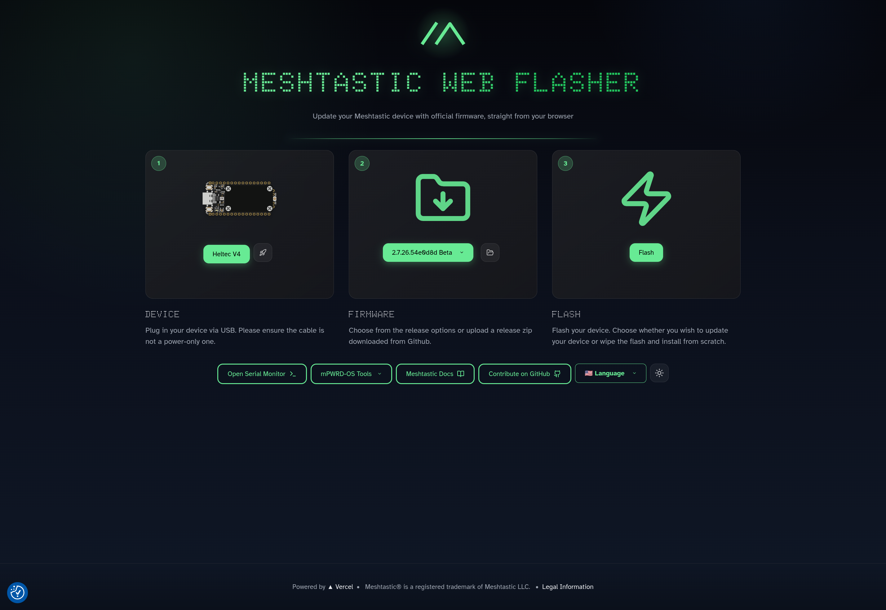
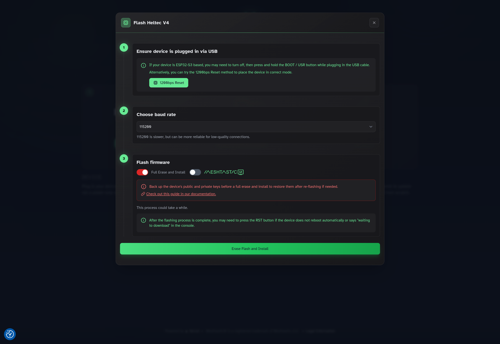

# Flash firmware

Use the Meshtastic web flasher. Target for this walkthrough: **Heltec V4** (from [Identify](identify.md)).

**Verified on this desk:** firmware **2.7.26.54e0d8d**, **Heltec V4** (`heltec-v4`), Full Erase on, MESHTASTIC/UI off → OLED detected (`SSD1306` at `0x3c`).

## Steps

1. Open [flasher.meshtastic.org](https://flasher.meshtastic.org/) in **Chrome / Chromium / Edge**.
2. Target: **Heltec V4** (`heltec-v4`).
3. Firmware **≥ 2.7.25** (this pass: 2.7.26.54e0d8d).
4. Enter [bootloader mode](bootloader.md) if needed.
5. Open **Flash** and set:
   - **Full Erase and Install**: **on**
   - **MESHTASTIC/UI**: **off**
   - Baud: **115200**
6. **Erase Flash and Install** → pick **USB JTAG/serial debug unit (`ttyACM*`)** → **Connect**.
7. Wait until app and filesystem hit **100%**. Tap **RST**.

## Why those toggles

- **Full Erase** pulls `.factory.bin`. Builds such as 2.7.26 often have no `*-update.bin` (HTTP 404).
- **MESHTASTIC/UI** on an OLED target can rewrite the download name (for example `…-oled-tft-…`) and 404. Leave it off for the stock OLED.

## Do not

- Rely on Update-only when the console reports HTTP 404 for `*-update.bin`.
- Flash a mismatched target (blank OLED) — see [Overview](index.md) and [Troubleshoot](troubleshoot.md).

Next: [First boot](first-boot.md).
