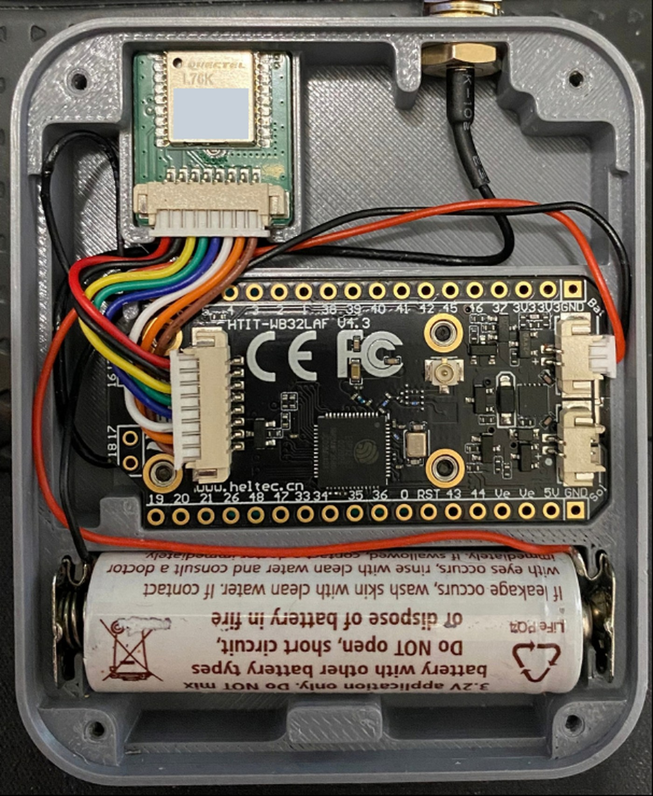

# Overview

Flash a **Heltec WiFi LoRa 32 V4** with Meshtastic, set region, and prove the node is alive.

<figure class="shot-fig" markdown="span">

<figcaption>Desk unit after flash — Heltec V4, Expansion Kit GPS, battery, SMA antenna.</figcaption>
</figure>

## Host note

Host-side checks and serial examples were done on **Fedora**. Flash and Meshtastic config are the same elsewhere; package names, serial groups, and device paths may differ.

## Path

1. [Prerequisites](prerequisites.md)
2. [Identify the board](identify.md)
3. [Bootloader mode](bootloader.md)
4. [Flash firmware](flash.md)
5. [First boot](first-boot.md)
6. [Configure](configure.md)
7. [Phone app](phone.md)
8. [Verify](verify.md)

Stuck? [Troubleshoot](troubleshoot.md). Numbers and links: [Reference](reference.md).

## Note

Flash **Heltec V4** (`heltec-v4`), not **V4 R8**. Wrong target → OLED stays black. Confirm on [Identify](identify.md).
